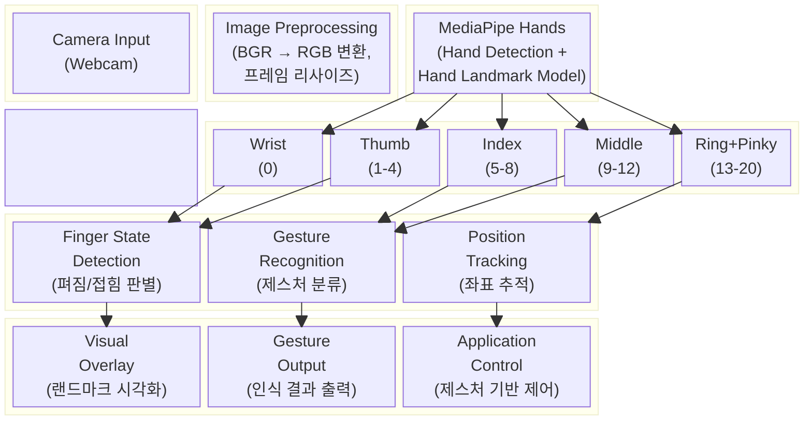
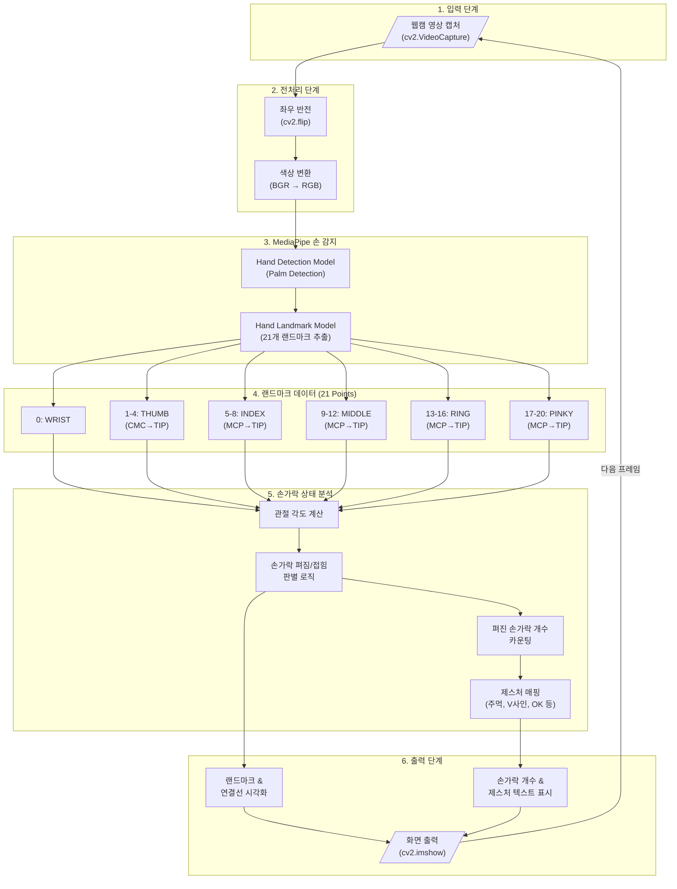
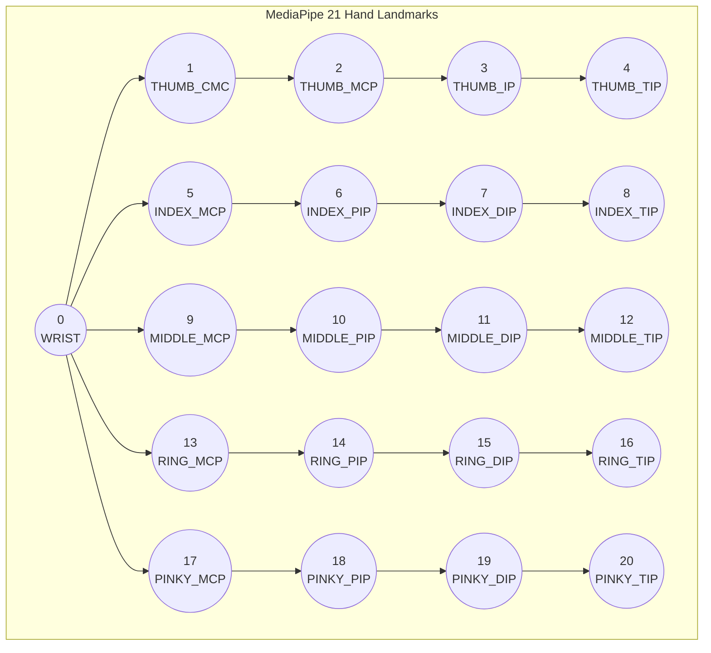

# MediaPipe Hand & Finger Recognition Project

MediaPipe를 활용한 실시간 손가락 인식 프로젝트

## System Block Diagram



## Data Flow Diagram



## MediaPipe Hand Landmarks Reference



## Tech Stack

| 구분 | 기술 |
|------|------|
| Language | Python 3.x |
| Computer Vision | OpenCV (cv2) |
| Hand Detection | MediaPipe Hands |
| Visualization | Mermaid, OpenCV Drawing |

## Project Structure

```
capston-project-github/
├── README.md
├── requirements.txt
├── main.py                # 메인 실행 파일
├── hand_detector.py       # MediaPipe 손 감지 모듈
├── finger_counter.py      # 손가락 상태 분석 모듈
└── gesture_recognizer.py  # 제스처 인식 모듈
```
